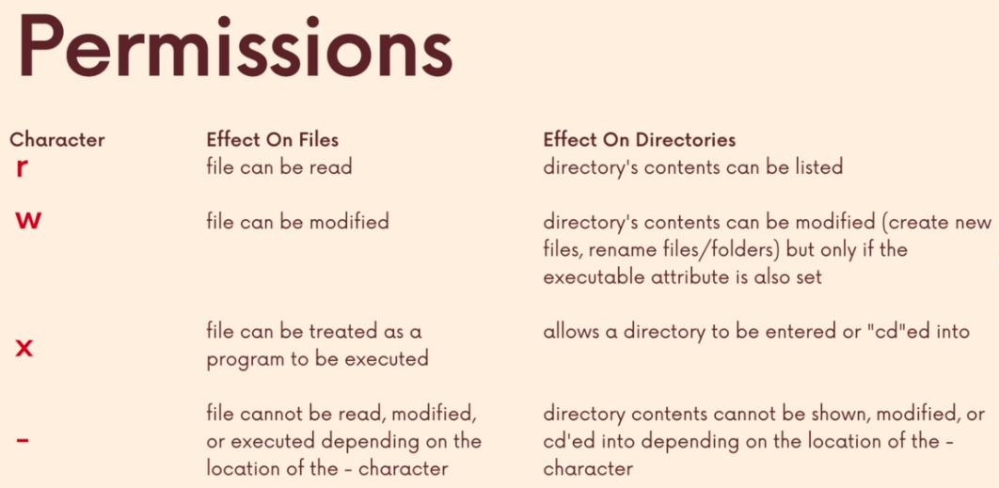
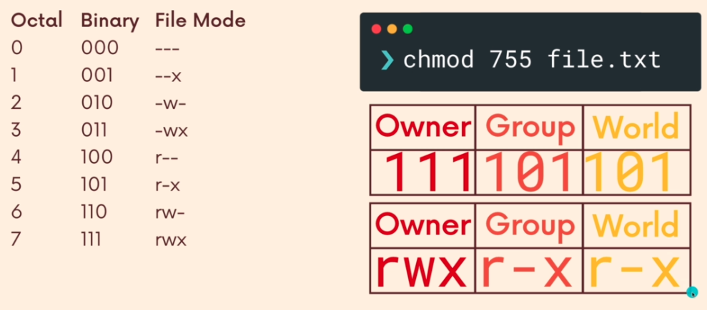
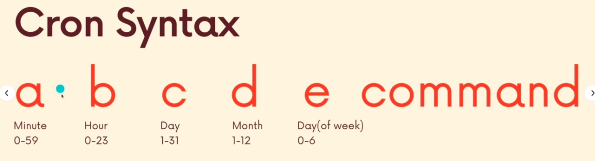
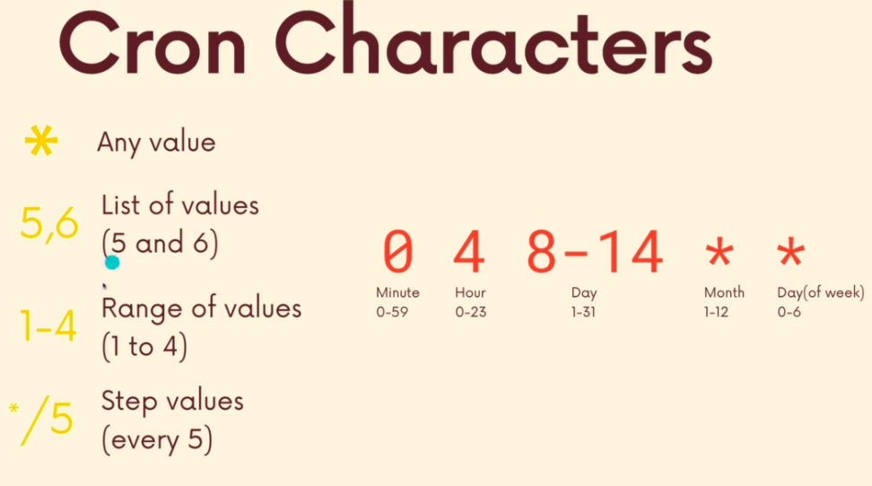

# The basic linux commands cheat sheet
This cheat sheet created based on the Udemy online course by Colt Steele: [The Linux Command Line Bootcamp: Beginner To Power User](https://www.udemy.com/course/the-linux-command-line-bootcamp/).

## Table of contents
* [Basic command structure](#basic-command-structure)
* [Important commands](#important-commands)
  * [manual command](#manual-command)
    * `man`
  * [navigation commands](#navigation-commands)
    * `pwd`
    * `ls`
    * `cd`
  * [creating files and folders](#creating-files-and-folders)
    * `touch`
    * `mkdir`
  * [deleting, copying, and moving](#deleting-copying-and-moving)
    * `rm`
    * `mv`
    * `cp`
  * [working with files](#working-with-files)
    * `cat (tac, rev)`
    * `less`
    * `head and tail`
    * `wc`
    * `sort`
    * `nano`
  * [Redirection](#redirection)
    * `>`: redirect standard output
    * `>>`: append standard output
    * `2>`: redirect standard error
    * `2>>`: append standard error
    * `<`: redirect standard input
  * [Piping](#piping)
    * `|`
    * `tee`
  * [Finding things](#finding-things)
    * `locate`
    * `find`
  * [Grep](#grep)
    * `grep`
  * [Permissions basics](#permissions-basics)
  * [Alter permissions](#alter-permissions)
    * `chmod`
    * `su`
    * `sudo`
    * `chown`
  * [Environment](#environment)
    * `printenv`
    * `$`
    * define variables
    * startup files
    * `alias`
* [Useful commands](#useful-commands)
* [Nice to have commands](#nice-to-have-commands)
* [Shortcuts](#shortcuts)
* [Expansion](#expansion)
  * pathname expansion
  * tilde expansion
  * brace expansion
  * arithmetic expansion
  * single and double quotes
  * command substitution
* [Regular expression](#regular-expression)
* [Bash scripts](#bash-scripts)


## Basic command structure
```s
command -options arguments
```

## Important commands
### Manual command
###### [Back to TOC](#table-of-contents)
* man
  * Read the manual page of a command
    ```s
    man ncal
    ```
  * Search a command
    ```s
    man -k <command_name>
    man -k passwd
    ```
  * Read the manual page of a command in a specific session
    ```s
    man 1 passwd
    ```
  * Not all commands have commands entries. Some commands that are build in shell do not have manual information and you can use ***help*** command. 
    ```s
    help cd
    ```

### Navigation commands
###### [Back to TOC](#table-of-contents) 
* pwd
  * Print the working directory
* ls
  * List the contents of a directory
  * List the contents of the current working directory:
    ```s
    ls
    ```
  * List the contents of a specific folder
    ```s
    ls <folder_dir>
    ls ~
    ```
  * List the contents of a directory with long format
    ```s
    ls -l
    ls -l <folder_dir>
    ```
  * List all the contents of a directory including hiding fils and folders
    ```s
    ls -a
    ls -a <folder_dir>
    ```
  * List **all** the contents of a directory with **long** format
    ```s
    ls -la
    ls -la <folder_dir>
    ```
  * List **all** the contents of a directory with **long** **human-readable** format
    ```s
    ls -lah
    ```
  * Lists the contents of a directory and **sorted** by size
    ```s
    ls -s
    ls --sort=time     # sort by time
    ```
* cd
  * Change the directory
    ```s
    cd folder_dir
    cd ..  # go to the parent directory
    cd ~   # go to user HOME directory
    cd /   # go to the root directory
    cd -   # go to the previous directory
    ```
  * **A single dot (.)**: the reference to the current directory
  * **Double dots (..)**: are the reference to the parent directory
  * **/**: the root directory
  * **~**: the user HOME directory
  * Overview of the directories in linux:
    * **/bin**: "bin" is short for "binary directory". This directory contains lots of executable programs.
    * **/etc**: contains configuration (setting) files and initialization scripts.
    * **/media**: accesses the contents of the removable media, such as usb drive and sd card.
    * **/var**: "var" is short for "variable". This directory contains files related with logging, the outputs from other programs, and caches.
    * **/root**: is the home directory of the super user (root user), which is different from "/".
    * **/usr**: contains executable files, libraries. If you install a software, it will be most likely in this folder.

### Creating files and folders
###### [Back to TOC](#table-of-contents) 
* touch
  * Change file timestamps (the original intended use of **touch** ^0^)
  * Create a **new** file or multiple **new** files **if not exist**
    ```s
    touch <file_path_and_file_name>
    touch <file_name_1> <file_name_2> # creating multiple files in the current directory
    ```
  * You can create a new file in a specified directory as well:
    ```s
    touch ~/abc.txt  # create a new file named abc.txt in the HOME directory
    ```
* mkdir
  * Create new directories
    ```s
    mkdir <file_name>
    mkdir <file_name_1> <file_name_2>
    mkdir <file_path_and_file_name>
    ```
  * If you want to make multiple nested directories, you can use ***-p*** option.
    ```s
    # this command will show ERROR if animals or cats directory is not available
    mkdir animals/cats/small_cats

    # this command will create all three directories even if 
    # animals and cats directories are not available
    mkdir -p animals/cats/small_cats 
    ```

### Deleting, copying, and moving
###### [Back to TOC](#table-of-contents) 
* rm
  * Remove files and directories from our machine
  * Remove files. The deleted file cannot be redo and **cannot be found from the trash can**.
    ```s
    rm <file_name>
    ```
  * Remove **empty** directories.
    ```s
    rm -d <empty_directories>
    rm --dir <empty_directories>
    rmdir <empty_directories>
    ```
  * Remove directories and their contents recursively.
    ```s
    rm -r <directories> # be careful when you run this command
    rm -R <directories> # be careful when you run this command
    rm -ri <directories> # remove the file and directories interactively
    ```
  * 
* mv
  * Move files and directories from one location to another location
    ```s
    mv <source> <destination> # destination directory is exist
    mv <source_1> <source_2> <destination> # destination directory is exist
    ```
  * Rename **a single** file or **a single** directory
    ```s
    mv <original_name> <new_name> 
    mv <original_dir_and_name> <new_dir_and_name> 
    ```
* cp
  * Copy files and directories
    ```s
    cp <source> <destination>
    cp <file_name> <new_file_name>
    cp <source_1> <source_2> <destination_dir>
    cp -r <dir_name> <destination_dir> # use -r to copy directory recursively
    ```

### Working with files
###### [Back to TOC](#table-of-contents) 
* cat
  * Concatenates and prints the contents of files to the terminal
    ```s
    cat <file_name>
    ```
  * Related (but less important) commands
    * tac
      * Concatenates and prints the contents of files to the terminal in **reverse** order for each line
        ```s
        tac <file_name>
        ```
    * rev
      * Concatenates and prints the contents of files to the terminal and reverse all characters in each line
        ```s
        rev 
        rev <file_name>
        ```
* less
  * Display the content of the file, one page at a time. 
    ```s
    less <file_name>
    ```
  * When viewing a file using less, 
    * press `space` or `f` to go the the next page
    * press `b` to go back to the previous page
    * press `enter` or `Down arrow` to scroll by one line
    * type `/ followed by a pattern` to search
    * press `q` to quit
* head
  * Print a port of a file starting from beginning. By default, print the first 10 lines of a file.
    ```s
    head <file_name>
    head -n 5 <file_name> # set how many lines to print out
    head -n5 <file_name> # set how many lines to print out
    head --lines 5 <file_name> # set how many lines to print out
    head -5 <file_name> # set how many lines to print out
    ```
* tail
  * Print a port of a file from the end By default, print the last 10 lines of a file.
    ```s
    tail <file_name>
    tail -n 5 <file_name> # set how many lines to print out
    tail -n5 <file_name> # set how many lines to print out
    tail --lines 5 <file_name> # set how many lines to print out
    tail -5 <file_name> # set how many lines to print out
    ```
* wc
  * This command prints counts the number of lines, words, and characters in one or multiple files 
    ```s
    wc <file_name>
    wc <file_name_1> <file_name_2>
    ```
  * Explain the output:
    ```s
    # output
    308  1703 10488 README.md
    # README.md file has 308 lines, 1703 words, and 10488 characters
    ```
  * Lines count
    ```s
    wc -l <file_names>
    ```
  * Words count
    ```s
    wc -w <file_names>
    ```
  * Characters count and bytes count
    ```s
    wc -m <file_names>
    wc -c <file_names>
    ```
* sort
  * Sort each lines in a given file
    ```s
    sort <file_name> # case insensitive, lower case come first
    sort -r <file_name> # sort with reverse order
    sort -n <file_name_with_numbers> # sort by comparing the numeric values in each line
    sort -u <file_name> # sort and only keep unique values
    ```
* nano
  * nano is a program that we can use to open and edit files from the command line
    ```s
    nano <file_path_and_file_name>
    ```
  * short cuts:
    * Shortcuts are written as follows: **Control-key** sequences are notated with a **'^'** and can be entered either by using the Ctrl key or pressing the Esc key twice.  **Meta-key** sequences are notated with **'M-'** and can be entered using either the **Alt, Cmd, or Esc** key, depending on your keyboard setup.
    * **Crtl + o (^O)**: write out the file and the nano will ask which file will be write to
    * **Ctrl + x**: exit/close
    * **Ctrl + s**: save the file changes
    * **Ctrl + c**: cancel
    * **Ctrl + g**: go to help manual
    * **Ctrl + w**: search
    * **Ctrl + \\**: search and replace
    * **Ctrl + t**: use spell checker
      * spell check is disabled by default. 
      * we can enable the spell check by editing the configuration file located at `/etc/nanorc` using `sudo nano /etc/nanorc`
    * **Alt + u (M-U)**: undo
    * **Alt + e**: redo
    * **Alt + s**: Soft wrapping of overlong lines enable/disable
  * We can use nano to **create a new file** as well. We can type nano and follow a file name that does not exists.
    ```s
    nano <file_name_that_to_be_created>
    ```

### Redirection
###### [Back to TOC](#table-of-contents)
* \>
  * Redirect standard output to a given file using `>`. The file will be completely **overwritten**.
    ```s
    command [options and argument] > file_name
    ```
* \>>
  * **Append** the standard output to a given file using `>>`.
    ```s
    command [options and argument] >> file_name
    ```
* 2>
  * Redirect standard error to a given file using `2>`. The file will be completely **overwritten**.
    ```s
    command [options and argument] 2> file_name
    ```
* 2>>
  * **Append** the standard error to a given file using `2>>`
    ```s
    command [options and argument] 2>> file_name
    ```
* <
  * Redirect standard input using `<`.
  * Standard input usually refers to the keyboard. We can use `<` to redirect the standard input from other sources, such as a file.
    ```s
    command [options and argument] < input_file_name # This is different from command [options and argument] input_file_name
    ```
  * I want to use `cat` as an example to further illustrate the differences between `command file_name` and `command < file_name`. 
    * `cat README.md` and `cat < README.md` use different mechanisms although their outputs are identical. 
      * Here is the user manual of `cat` command:
        ```
        NAME
         cat - concatenate files and print on the standard output

        SYNOPSIS
              cat [OPTION]... [FILE]...

        DESCRIPTION
              Concatenate FILE(s) to standard output.

              With no FILE, or when FILE is -, read standard input.
        ...
        ```
      * `cat README.md` use SYNOPSIS format: `cat [OPTION]... [FILE]...`. So README.md is a FILE for cat command.
      * `cat < README.md` means there is no FILE for cat, so "read standard input" instead. "< README.md" is the standard input.

### Piping
###### [Back to TOC](#table-of-contents)
* `|`
  * We use the pipe character(`|`) to connect two commands. The output of the first command will be passed to the standard input of the second command.
    ```s
    command_1 | command_2
    ```
  * examples of using piping:
    ```s
    ls /bin -l | less
    ls /bin -l | wc -l
    ncal | tac | rev  # pip three commands
    ```
* tee
  * The tee command reads the standard input and **copies** the standard input **both** to the standard output **AND** to a file. 
  * This allows to capture information part of the way through a pip without interrupting the flow. 
  * Examples:
    ```s
    command_1 | tee output_file | command_2
    cat README.md | tee output.txt | wc -w
    du -ha /usr/bin/ | sort -h | tee sizes.txt | tail -4 | head -3
    ```
    * `cat README.md | tee output.txt | wc -w`: `cat` read the README.md file. Then, `tee` took the standard output from `cat` as its own standard input, wrote this standard input into output.txt, and sent the same information as standard output of `tee`. Then, `wc -w` took the standard output from `tee` as its own standard input and count number of words and sent out the result (word count) as standard output. 

### Finding things
###### [Back to TOC](#table-of-contents)
* locate, mlocate
  * Perform a fast search of pathnames across my machine that match a given substring and then prints out any matching names. 
  * The search is case sensitive by default.
    ```s
    locate README.md
    mlocate README.md
    ```
  * Use -i to ignore casing.
    ```s
    locate -i MvN
    ```
  * Use -e will return the files that are actually exists. Check `man locate` for details.
    ```s
    locate -e README.md
    ```
  * The path information is saved in a database. This database is periodically updated. locate/mlocate identify pathnames/patterns against the database. It is possible that the database is not updated so the output from locate/mlocate command is not accurate. We can use `sudo updatedb` to update this database.
* find
  * Find command is much slower than locate command.
  * Find is case sensitive by default.
  * By default, find command on its own will list every single file and directory nested in our current working dir.
    ```s
    find
    ```
  * If we provide a folder as the argument, then find command will print out all the files and directories inside of the provided directory.
    ```s
    find ./../
    ```
  * We can provide `-type` option to ask for only print files or directories, symbolic links.
    * `find -type f` will limit the search to files
    * `find -type d` will limit the search to directories.
      ```s
      find ~/Documents -type d
      ```
  * We can use `-name` option to search for a specific pattern.
    ```s
    find ~/Documents -name "R*.md"
    find ~ -name "*.txt" -type f
    ```
  * We can use `-size` option find files by size.
    ```s
    find -size +1G  # find all files that are larger than 1G
    find -size -50M # find all files that are under 50 megabytes
    find -size 20k  # find all file that are exactly 20 kilobytes 
    ```
  * We can use `-user` option find the files and folders owned by a specific user.
    ```s
    sudo find /home -user kitty
    ```
  * We can use `-empty` find any empty files and folders that are currently empty.
    ```s
    find -empty
    find ~ -empty -type d
    find .. -empty -type f
    rm $(find . -empty -type f) # remove all empty files in the current and the nested child directories
    rm `find . -empty -type d` # remove all empty nested directories
    ```
  * We can find by time.
    * There are three types of time for a file in the linux system:
      * **mtime**, or modification time, shows when a file was last modified
        ```s
        ls -l # shows the modified time
        ```
      * **ctime**, or change time, shows when a file was last changed. This occurs anytime mtime changes but also when when we rename a file, move it, or alter permissions.
        ```s
        ls -lc # -c stands for the change time
        ```
      * **atime**, or access time, is updated when a file is read by an application or a command like `cat`.
        ```s
        ls -lu # -u stands for the access time
        ```
    * We can find files and directories that are modified/changed/accessed based on the ime. Here are some examples.
      * Find all files and directories (under the current and the nested directories) that are modified(`-mmin`)/changed(`-cmin`)/accessed(`-amin`) at exactly 30 minutes, longer than 30 minutes, less than 30 minutes.
        ```s
        find -mmin 30   # modified for exactly 30 minutes
        find -mmin -30  # modified less than 30 minutes ago
        find -mmin +30  # modified longer than 30 minutes

        find -cmin 30   # changed for exactly 30 minutes
        find -cmin -30  # changed less than 30 minutes ago
        find -cmin +30  # changed longer than 30 minutes

        find -amin 30   # accessed for exactly 30 minutes
        find -amin -30  # accessed less than 30 minutes ago
        find -amin +30  # accessed longer than 30 minutes
        ```
      * `-atime`, `-ctime`, `-mtime` works similar to `-amin`, `-cmin`, and `-mtime`. The differences are `-atime 1` means accessed at exactly 1 **day** rather than 1 minute.
        ```s
        find -mtime 30   # modified for exactly 30 days
        find -mtime -30  # modified less than 30 days ago
        find -mtime +30  # modified longer than 30 days

        find -ctime 30   # changed for exactly 30 days
        find -ctime -30  # changed less than 30 days ago
        find -ctime +30  # changed longer than 30 days

        find -atime 30   # accessed for exactly 30 days
        find -atime -30  # accessed less than 30 days ago
        find -atime +30  # accessed longer than 30 days
        ``` 
  * Use find command with logical operators:
    * We can use `-and`, `-or`, and `-not` operators to create more complex queries.
      ```s
      find -name "*chick*" -or -name "*kitty*"
      find -type -f -not -name "*.html"
      ```

### Grep
###### [Back to TOC](#table-of-contents)
* grep
  * The grep command searches for patterns in each file's content. Grep will print each line that matches a pattern we provide.
    ```s
    grep <PATTERN> <FILE>
    grep "create" README.md
    ```
  * Grep by default is case sensitive. We can make it case in sensitive to use `-i` option.
    ```s
    grep -i "CrEaTe" README.md
    ```
  * Grep can be set to match exact the whole word using `-w` option.
    ```s
    grep -w "is" README.md
    ```
  * We can use `-r` option to perform a recursive search which will include all files under a directory, subdirectories and their files, and so on. If we don't specify the starting directories, grep will search the current working directory.
    ```s
    grep -r "code"
    ```
  * We can use `-c` option to count how many times dose a pattern appears.
    ```s
    grep -c "I" README.md
    grep -cw "I" README.md  # -w mean match the whole words
    ```
  * We can display the lines before or/and after the match using `-A`, `-B`, or `-C` options.
    ```s
    grep "I" README.md -A1 # also display 1 line after the matched line
    grep "I" README.md -B2 # also display 2 lines before the matched line
    grep "I" README.md -C3 % als0 display 3 lines before and after the matched line
    ```
  * We can display the line number using `-n` option.
    ```s
    grep -n "I" README.md
    ```
  * We can use [regular expression](#regular-expression) to search defined patterns.
    ```s
    grep 'mac$' README.md # search the pattern "mac" at the end of the line
    ```
    * `grep` command can search for the linux basic regular expression and extended regular expression (with `-E` option). You can find a little bit more details in the [regular expression](#regular-expression) session.

### Permissions basics
###### [Back to TOC](#table-of-contents)
* Unix and unix-like systems are multi-user operating system. They can have multiple uses login to the system at the same time.
* File owners and group owners
  * Each file and directory has a single owner and a group owner. A group owner can have one or multiple users. For example: 
    * `drwxr-xr-x 2 feifei feifamily 4096 Dec 21 13:56 Desktop` means the Desktop directory has a owner of feifei and a group owner of feifamily.
* File attributes
  * `ls -l ~` commands list 10-character file attributes: `-rw-rw-r--`. These characters tell us the type of the file, the read, write, and execute permissions for the file's owner, the file group user, and everyone else.
    
    * The first letter tell use the file type:
      * `-`: regular file
      * `d`: directory
      * `c`: character special file
      * `l`: symbolic link
    * The last 9 characters tells use about the permission. Take `drwxr-xr-- 2 feifei feifamily 4096 Dec 21 13:56 Desktop` as an example: 
      * The first letter `d` tells us that Desktop is a directory.
      * The first 2-4 letters `rwx` tells us the permissions of the **owner**.
      * The first 5-7 letters `r-x` tells us the permissions of the members in the **group owner**.
      * The last three letters `r--` tells us the permissions of the **other users**.
      * Among these three letters for the owner, the group owner, or the other users, the first letter tells us the read permission, the second letter tells use the write permission, the third letter tells us the executable permission. `-` means permission is not granted.
      
      * For directory, `x` means user can `cd` into this directory. For file, `x` means this file can be run as a script.

### Alter permissions
###### [Back to TOC](#table-of-contents)
* chmod (change mode)
  * Please read [permissions basics](#permissions-basics) session if you are not familiar with owner, owner group, read permission, write permission and execute permission.
  * We can use `chmod` command to change the permissions of a file or a directory.
    ```s
    chmod mode <file or directory>
    ```
  * To use chmod to alter permissions, we need to tell linux:
    * **who** we are changing permissions for
      * `u` : user (the owner of the file)
      * `g` : group (members of the group the file belongs to)
      * `o` : others
      * `a` : all above
    * **what** change are we make? Adding? Removing?
      * `-` : removes the permission
      * `+` : grants the permission
      * `=` : set a permission and removes other permissions
    * **Which** permissions are we setting?
      * `r` : the read permission
      * `w` : the write permission
      * `x` : the execute permission
    * Here are some examples:
      ```s
      cd test_dir # go to test_dir directory, so that you can play with test.txt file
      ls -l # use this command to display current permissions of files in this directory

      chmod o+w test.txt # grant write permission to other users for test.txt file
      ls -l # check what happened

      chmod u+x test.txt # grant execute permission to the owner for test.txt file
      ls -l

      chmod u-x test.txt # remove execute permission to the owner for test.txt file
      ls -l

      chmod u=w test.txt # set write permission to the owner, but remove read and execute permission to the owner
      ls -l

      chmod u-rw test.txt # remove the read and write permissions to the owner for test.txt file
      ls -l
      cat test.txt # cat: test.txt: Permission denied

      chmod a+rwx text.txt # grant read, write and execute permissions to all users
      ls -l
      ```
  * Using Octals with chmod
    * `chmod` also supports another way of presenting permission patterns using three octal numbers (base 8). 
    * These three octal numbers represent the permissions for the owner, group owner, and other user.
    * Each digit in an **octal number** represents 3 **binary digits**, and these three binary digits represent the whether the permissions of read, write, and execute are granted or not.
      
    * In the picture above, `chmod 755 file.txt`, chmod command is followed by three octal numbers, `7`, `5`, `5`. These three numbers represent the permissions of this file to the owner (`7`: 111 -> rwx), the group owner (`5`: 101 -> r-x), and other users (`5`: 101 -> r-x).
    * You don't need to remember the meaning for all the octal numbers. Here are some most common ones:
      * `7`: rwx, read, write, and execute permissions are granted.
      * `4`: r--, read only.
      * `6`: rw-, read, and write permissions are granted.
      * `1`: --x, execute only.
      * `0`: ---, no permissions are granted.
* su
  * `su` command is used to substitute the user and group ID.
  * `-, -l, --login` option start the shell as a login shell with an environment similar to a real login. Please check for more details of this option using `man su` command.
    ```s
    su <user_2> # log in as user_2 in this terminal
    su - <user_2> # log in as user_2 and also update the user_2's environment
    ```
* sudo
  * Ubuntu locks the root user by default and we can run the commands under the privilege of root user by `sudo` command.
    ```s
    sudo apt update
    ```
* chown
  * We can change the ownership of files and directories by `chown` command.
  * Regular user cannot change owners. We can run `chown` command with `sudo` to change the ownership.
    ```s
    chown USER[:GROUP] FILE(s)
    sudo chown user2 test.txt # change the ownership of this file to user2
    sudo chown :group2 test.txt # change the group ownership of this file to group 2
    ```

### Environment
###### [Back to TOC](#table-of-contents)
* printenv
  * We can use the `printenv` command to view the environment variables and their current values.
    ```s
    printenv
    printenv | less
    ```
* $ (parameter expansion)
  * If we write out the name of an environment variable prefixed with a dollar sign (`$`), the shell will replace it with the actual value.
    ```s
    echo $USER
    echo $HOME
    echo $PWD # the current working directory
    echo $OLDPWD # the previous working directory
    ```
* Define variables
  * Shell variable:
    * only exists in the current shell session of the shell.
  * Environment variable:
    * exists for the current user across all shell sessions.
  * Define shell variable:
    * We can use the syntax `variable=value` to define a **shell variable**.
    * The built-in variables are upper-cased, so it is a common convention to use lowercase custom variables to prevent confusions. 
    * The variables defined in this way is temporary, and the defined variable will be cleared when you logout this user.
      ```s
      laugh=hahaha
      echo $laugh
      ```
    * The **shell variable** defined in this way will not be displayed by `printenv` command, because `printenv` only print **environment variable**.
  * Define environment variable:
    * We use the syntax `export variable=value` to define a **environment variable**.
      ```s
      export laugh=hehehehe
      echo $laugh
      printenv | grep laugh
      ```
    * **This variable will be cleared if I close this terminal and open a new one.**
* Startup Files
  * When we log in, the shell reads information from startup files. First, the shell reads from global config files that effect the environment for all users, then shell reads startup files for specific users.
  * The specific files the shell reads from depends on the type of session: login vs. non-login shell sessions.
  * For login sessions:
    * `/etc/profile`: the global config for all users
    * `~/.bash_profile`: user's personal config file
    * `~/.bash_login`: read if bash_profile isn't found
    * `~/.profile`: read if previous two aren't found
  * For non-login sessions (typical session when you launch the terminal via the GUI):
    * `/etc/bash.bashrc`: global config for all users
    * `~/.bashrc`: specific settings for each user. This is where we can define our own settings and configuration
* alias
  * We can define our own commands using `alias` command.
    ```s
    alias bark='echo wooooof'
    bark # output wooooof
    ```
  * We can save our own aliases in the `~/.bashrc` file so that my own aliases can be loaded when I open a new shell.
    ```s
    # you can use this command to find the aliases that have been
    # defined in ~/.bashrc file.
    cat ~/.bashrc | grep alias 
    ```
  * You can also define your aliases in `~/.bash_aliases` file instead of adding them directly in `~/.bashrc` file.

## Useful commands
###### [Back to TOC](#table-of-contents) 
* clear
  * Clear the terminal
* file
  * Show the type of the file (or the folder)
    ```s
    file <file_name or folder_name>
    ```
* gtk-launch
  * `gtk-launch` launches an application using the given name.
  * `gtk-launch` takes at least one argument, the name of the application to launch. The name should match application desktop file name, as residing in /usr/share/application, with or without the '.desktop' suffix.
    ```s
    gtk-launch atom
    ```
* history
  * Display all the command lines you entered previously
    ```s
    history
    history | less
    ```
  * You can rerun the history commands using "!+history_id"
    ```s
    history # this list the history commands with id
    !7 # run the command of id 7 in the history
    ```
  * You can use "Ctrl + r" to search history
  * History commands are saved in "~/.bash_history", so you can find all the history commands using `nano ~/.bash_history`.
* type
  * Tells the types of command
    ```s
    type <command_name>
    ```
  * There are four types of commands:
    * An executable program which usually stored in /bin, /usr/bin, or /usr/local/bin. These are compiled binary files (hence bin)
    * A built-in shell command. These commands are part of the shell, such as bash and zsh.
    * A shell function.
    * An alias.
* xdg-open, open
  * Open a specific folder in the gui of ubuntu
    ```s
    xdg-open <folder_dir>
    ```
  * Open a specific folder in the gui of mac
    ```s
    open <folder_dir>
    ```
* which
  * Tells where is the command is located.
  * Related commands: ***type***, ***man***
    ```s
    which command_name
    ```

## Nice to have commands
###### [Back to TOC](#table-of-contents) 
* date
  * Print out the time of the system
* ncal 
  * Print out a vertical calender of current month
  * Print out the calendar of the entire year: 
    ```s
    ncal 2025
    ```
  * Print out the calendar of a given month in a given year
    ```s
    ncal jan 2022
    ```

## Shortcuts
###### [Back to TOC](#table-of-contents)
* **Ctrl + a**: jump the cursor at the begin of the line.
* **Ctrl + e**: jump the cursor at the end of the line.
* **Ctrl + f**: move the cursor forward for one character.
* **Ctrl + b**: move the cursor backward for one character.
* **Alt + f**: move the cursor forward for one word.
* **Alt + b**: move the cursor backward for one word.
* **Crtl + l**: clear console by moving view part up.
* **Ctrl + t**: swap two characters next to each other.
* **Alt + t**: swap two words next to each other.
* **Ctrl + k**: kill the text from the current cursor to the end of the line.
* **Ctrl + u**: kill the text from the current cursor to the beginning of the line.
* **Alt + d**: kill the text from the current cursor to the end of the word.
* **Ctrl + d**: kill the character in the current cursor.

## Expansion
###### [Back to TOC](#table-of-contents)
* Pathname expansion
  * Wildcard characters:
    * `*`: represents **zero or more** characters.
      ```s
      cat *.txt
      ```  
    * `?`: represents any **single** character.
      ```s
      less READM?.md
      ```
    * `[ ]`: we can specify **a range of** characters to match inside of square brackets(`[]`).
      ```s
      `ls [A-F]*.txt` 
      ```
    * `[^ ]`:we can specify **a range of** characters to **NOT** match Inside of square brackets(`[^]`).
      ```s
      ls [^aApP]*.txt
      ```
    * See more in the [Regular Expression session](#regular-expression)

* Tilde expansion
  * `~` expansion refers to the HOME directory of the current user.
    ```s
    ls ~/Documents
    ```

* Brace expansion
  * Brace expression (`{}`) is used to generate arbitrary strings. Basically, it will generate multiple strings for us based on a pattern. We provide a set of strings inside of braces, as well as optional surrounding prefix and suffixes.
  * The specified strings are used to generate all possible combinations with optional prefixes and suffixes. 
  * The command below will create three files: page1.txt, page2.txt, page3.txt
    ```s
    touch page{1,2,3}.txt
    ```
  * The command below will create 5 files based on the range {1..5}: t1.txt, t2.txt, t3.txt, t4.txt, t5.txt
    ```s
    touch t{1..5}.txt
    ```
  * We can also provide an interval like this example below
    ```s
    mkdir t{1..10..4} # {1..10..4} means increasing from 1 to 10 with an interval of 4
    ```
  * {} works for the letters as well
    ```s
    echo {a..m}
    ```
  * We can nest {} inside a {}
    ```s
    echo {x,y{1..5},z} # output: x y1 y2 y3 y4 y5 z
    ```

* Arithmetic expansion
  * The shell perform arithmetic via expansion using the `$((arithmetic expression))` syntax.
    ```s
    echo $((2+3))  # output: 5
    echo $((2**5)) # output: 32
    ```
  * Here is a list of arithmetic operations:
    * `+`:  addition
    * `-`: subtraction
    * `*`: multiplication
    * `/`: division
    * `**`: exponentiation
    * `%`: modulo (reminder operator)

  * Arithmetic expression in bash seems to only work with **whole number**, such as long and integer.

* Quoting expansion
  * Double quotes (`" "`)
    * If we wrap text in double quotes, the shell will respect our spacing and will ignore special characters **except for dollar sign ($), backslash (\\), and back ticks (`)**.
      ```s
      echo "look at   me"     # output: look at   me
      echo "{1..9"}           # output: {1..9}
      echo "path: $PATH"      # output: path: /usr/local/sbin:/usr/local/bin:/usr/sbin
      echo "today is $(date)" # output: today is Tue 04 Jan 2022 07:36:28 AM CST
      ```
    * Pathname expansion, brace expansion, and word splitting will be ignored.
    * However, command substitution and arithmetic expansion are still performed because dollar sign still have meaning inside of double quote
  * Single quotes (`' '`)
    * Single quotes in shell suppress all forms of substitutions.
      ```s
      echo 'path: $PATH'      # output: path: $PATH
      echo 'today is $(date)' # output: today is $(date)
      ```
* Command substitution
  * We can use `$(command_2)` syntax to display the output of this command_2.
    ```s
    echo "today is $(date)" # output: today is Tue 04 Jan 2022 07:36:28 AM CST
    ```
  * We can also use `` syntax to display the output of command inside of back ticks.
    ```s
    echo "today is `date`" # output: today is Tue 04 Jan 2022 07:36:28 AM CST
    echo today is `date`   # output: today is Tue 04 Jan 2022 07:36:28 AM CST
    `echo node`            # This will open the node console for me 
    ```

## Regular Expression
###### [Back to TOC](#table-of-contents)
* Regular expression (Regex) helps us to match patterns.
  * Basic regular expression:
    * `.` matches any single character.
    * `^` matches the start of the line.
    * `$` matches the end of the line.
    * `[abc]` matches any single character in this set.
    * `[^abc]` matches any single character not in this set.
    * `[A-Z]` matches a single character in this range of A-Z
    * `*` repeats the previous expression 0 or more times.
    * `\` escapes meta-characters.
    * `()` groups the regular expressions.
  * Extended regular expression:
    * in `grep` command, we use `-E` option to enable extended regular expression. 
    * `?` match 0 or 1 preceding expression.
      ```s
      grep "patterns?" README.md # use basic regular expression
      grep "patterns?" -E README.md # ? means 's' is optional. Match pattern or patterns
      ```
    * `a{3}` means aaa. `[A-Z]{5}` means having 5 of any characters from A to Z, such as ABCZA.
      ```s
      grep "[aeiou]{2,4}" -E README.md # find 2 ~ 4 vowels next the each other.
      ```

## Bash scripts
###### [Back to TOC](#table-of-contents)
* A simple bash script, called hi, can be found in [scripts folder](#./scripts/hi).
  ```bash
  #!/bin/bash

  # This is a comment line
  echo "Hi, $USER"
  echo "Today is $(date)"
  echo "last run hi at $(date)" >> hi.log
  ```
  * The first line should be `#!/bin/bash`.
  * `#` stands for the comment line.
  * Then, we can write shell commands in this file.
  * This file can be run by `bash ./scripts/hi` or `sh ./scripts/hi`
  * We can not run `hi` directly without additional setup.
* `PATH` variable defines a set of directory (separated by :) where the bash scripts are stored.
  ```s
  echo $PATH
  # output: /usr/local/sbin:/usr/local/bin:/usr/sbin:/usr/bin:/sbin:/bin:/usr/games:/usr/local/games:/snap/bin
  ```
  * If our hi script is stored in one of these directories, then we can run our hi script by simply type `hi` in the terminal.
  * We can add our own directory into the PATH variable so that the bash script stored in that directory can be run by simply type the name of the bash script.
  * By conventional, we can store our personal bash scripts in `~/bin` directory. If `~/bin` is not available in your machine, then you can create `~/bin` by yourself `mkdir ~/bin`. Then, you can add `~/bin` to the PATH variable so that `~/bin` directory can be used to store and run your personal bash scripts. In Ubuntu, you can add `~/bin` directory to PATH by running `source ~/.profile` command. Alternatively, you can open `~/.bashrc` file, and then type and save `PATH="$HOME/bin:$PATH"` at the last line.
  * Lastly, we should make `hi` file executable in `~/bin`.
    ```s
    cd ~/bin
    chmod a+x hi
    ```
* Shebang
  * The first line of [hi file in scripts directory](./scripts/hi) defines which language should be used to run this script. `#!/bin/bash` tells linux terminal that we should run this script using `/bin/bash.`
  * This sequence of characters (#!) is called shebang and is used to tell the operating system which interpreter to use to parse the rest of the file.
  * Read more about shebang with this [link](#https://linuxize.com/post/bash-shebang/).
    ```bash
    #!/bin/bash
    echo "Hi, $USER"
    echo "Today is $(date)"
    echo "last run hi at $(date)" >> hi.log
    ```
  * We can add shebang at the first line to define what language should terminal to run.
    * To allow terminal run the script written in python3, we can add `#!/usr/bin/python3` into the first line of the script.
      ```python
      #!/usr/bin/python3
      print("Hi from python")
      ```
    * We use use `#!/usr/bin/perl` to tell the terminal to run the script below with perl.
      ```perl
      #!/usr/bin/perl
      print "Hi from perl"
      ```

## Schedule services
###### [Back to TOC](#table-of-contents)
* The cron service allows us to schedule commands to run at regular intervals like every 1 hour, every day at the midnight, etc.
* To setup a cron job, we need to edit the crontab configuration file. Rather than edit the file directly, it's best to use the `crontab -e` command. 
  ```s
  crontab -e
  ```
* Cron Syntax
  
* Cron Characters
  
  * Examples:
    * `30 * * * * command1` means run the command1 every time when the clock shows xx: 30.
    * `0 0 * * * command2` means run the command2 everyday at midnight (00:00).
    * `30 6 * * * command3` means run the command3 at 6:30 am everyday.
    * `30 6 * * 1 command4` means run the command4 at 6:30 am every Monday.
    * `30 6 * 4 1 command5` means run the command5 at 6:30 am every Monday in April.
    * `0 0 1 * * command6` means run the command6 at 00:00 on the first day of each month.
    * `0 0 . . 1-5 command7` means run the command7 at 00:00 every weekday (monday - friday).
    * `*/5 * * * * command8` means run the command8 every 5 minutes

  * You can learn more about the cron job syntax in [crontab guru](https://crontab.guru/) website.
* Handle errors in the cron jobs:
  * you can use `2>>` to redirect error logs in cron job. For example:
    ```s
    * * * * * errorcommand 2>> ~/error.log
    ```
